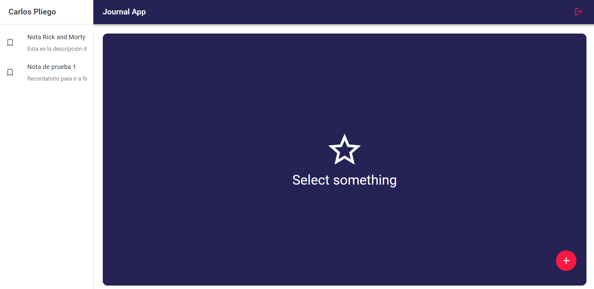
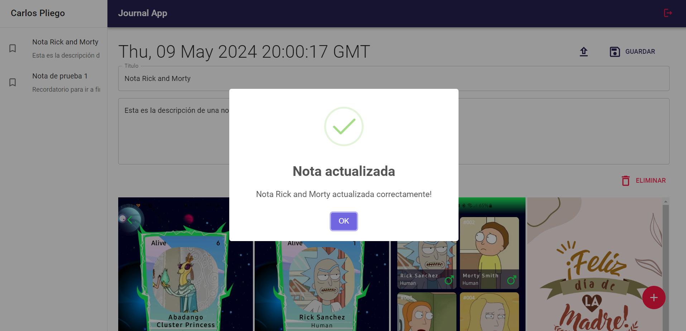

# Journal App

Esta es una aplicación de notas desarrollada como parte del curso de React: de cero a experto de Fernando Herrera en la plataforma Udemy.

## Tabla de contenidos

- [Visión general](#visión-general)
  - [Características](#características)
  - [Captura de pantalla](#captura-de-pantalla)
  - [Enlaces](#enlaces)
- [Mi proceso](#mi-proceso)
  - [Construido con](#construido-con)
  - [Lo que aprendí](#lo-que-aprendí)
  - [Desarrollo continuo](#desarrollo-continuo)
  - [Recursos útiles](#recursos-útiles)
- [Autor](#autor)
- [Agradecimientos](#agradecimientos)

## Visión general

### Características

- **Autenticación**: Login y registro de usuarios, incluyendo inicio de sesión con Google.
- **CRUD**: Operaciones completas de creación, lectura, actualización y eliminación de notas en Firestore.
- **Almacenamiento de imágenes**: Integración con Cloudinary para subir y almacenar imágenes.
- **Animaciones**: Utilización de Animate.css para animaciones.
- **Alertas**: Implementación de alertas con SweetAlert2.
- **Rutas**: Manejo de rutas con React Router DOM.

### Captura de pantalla

### Enlaces

- URL de la aplicación demo: [Journal App Demo](https://galaxypliego.github.io/journal-app/)

## Mi proceso

### Construido con

- [Redux](https://redux.js.org/) y [Redux Toolkit](https://redux-toolkit.js.org/)
- [Vite](https://vitejs.dev/) - Empaquetador de aplicaciones
- [Firebase Authentication](https://firebase.google.com/products/auth)
- [Firestore](https://firebase.google.com/products/firestore) - Base de datos NoSQL en tiempo real
- [Cloudinary](https://cloudinary.com/) - Almacenamiento de imágenes
- [Animate.css](https://animate.style/) - Librería de animaciones CSS
- [SweetAlert2](https://sweetalert2.github.io/) - Alertas bonitas
- [React Router DOM](https://reactrouter.com/) - Enrutador de aplicaciones React

### Lo que aprendí

Durante el desarrollo de esta aplicación, aprendí a:

- Integrar Redux con Redux Toolkit para manejar el estado global de la aplicación.
- Implementar autenticación con Firebase y Google.
- Configurar y utilizar Firestore para operaciones CRUD.
- Subir y gestionar imágenes con Cloudinary.
- Añadir animaciones atractivas usando Animate.css.
- Implementar alertas personalizadas con SweetAlert2.
- Manejar rutas dinámicas con React Router DOM.

### Desarrollo continuo

Estoy planeando mejorar la aplicación agregando más funcionalidades, como la posibilidad de compartir notas y una mejor gestión de usuarios.

### Recursos útiles

- [Documentación de Redux](https://redux.js.org/)
- [Guía de Firebase Authentication](https://firebase.google.com/docs/auth)
- [Ejemplos de Cloudinary](https://cloudinary.com/documentation)
- [Animate.css](https://animate.style/) - Librería de animaciones CSS

## Autor

- Sitio web - [Carlos Espinoza](https://galaxypliego.github.io/portfolio-web-one/)
- Frontend Mentor - [@GalaxyPliego](https://www.frontendmentor.io/profile/GalaxyPliego)
- Github - [@GalaxyPliego](https://github.com/GalaxyPliego)
- LinkedIn - [Carlos Espinoza](https://www.linkedin.com/in/carlos-espipliego/)

## Agradecimientos

Gracias a Fernando Herrera por el excelente curso de React y a la comunidad de desarrolladores en Udemy por su apoyo y recursos compartidos.
